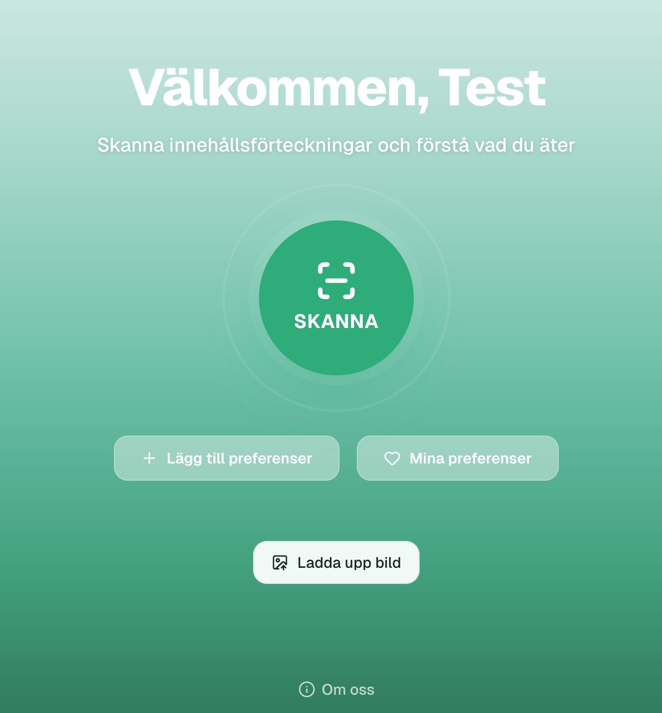
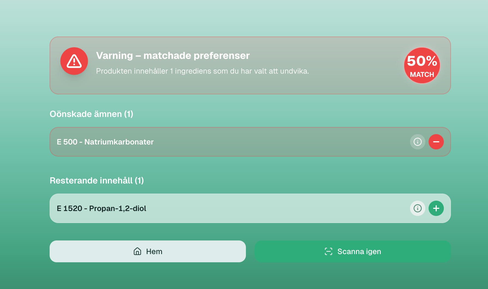

# Utveckling av en webapp - IngredientScanner

Tillsammans med 5 andra studenter utvecklade vi en web applikation där man som användare kan scanna innehållsförteckningen på olika livsmedel och få varningar för de E-ämnen som man valt i sin preferens lista. Vi har satt upp en lista med alla E-ämnen som finns på Livsmedelsverket och där man som användare kan välja de E-ämnen som man inte vill ska finnas i de livsmedel man köper. Scanner funktionen kan scanna innehållsförteckningen eller streckkoden på livsmedlet.

---
Denna del visar procent andelen av hur mycket av användarens preferenser som matchar de E-ämnen som finns i livsmedlet
```tsx
const warningsCount =
    results.warnings.eNumbers.length + results.warnings.food.length

  const otherCount = results.other.eNumbers.length + results.other.food.length

  const totalCount = warningsCount + otherCount

  const warningsPercentage = (warningsCount / totalCount) * 100
```
---
<p align="center">

    
</p>
