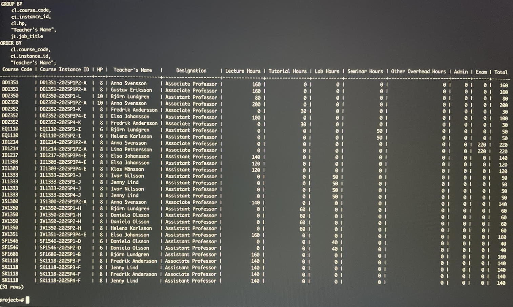

# Utveckling av databas
Tillsammans med två andra studenter utvecklade och skapade vi en databas där entiteter som olika kursinstanser,  
employment, department, kurs layouts m.m hanterades. Vi började med att skapa en conceptual model och gick noggrant igenom datamodelleringen för att få vart enda detalj att stämma. Vi tog hänsyn till olika constraints och vilka typer av deletes som är mest anpassade. Utifrån conceptual model kunde vi skapa en databas och behövde ändra och lägga till vissa constraints eller liknade för att få den att fungera som planerat. SQL queries användes kontinuerligt under processen för att felsöka eller optimera databasen. 

Denna visar hur vi skapade en primär nyckel för tabellen planned_activity och hur vi skapar en tabell allocations i databasen
```sql
ALTER TABLE planned_activity ADD CONSTRAINT PK_planned_activity PRIMARY KEY (id_teaching,instance_id  );


CREATE TABLE allocations (
 id_person INT NOT NULL,
 id_teaching INT NOT NULL,
 instance_id   VARCHAR(30) NOT NULL,
 allocated_hours NUMERIC NOT NULL
);
```


